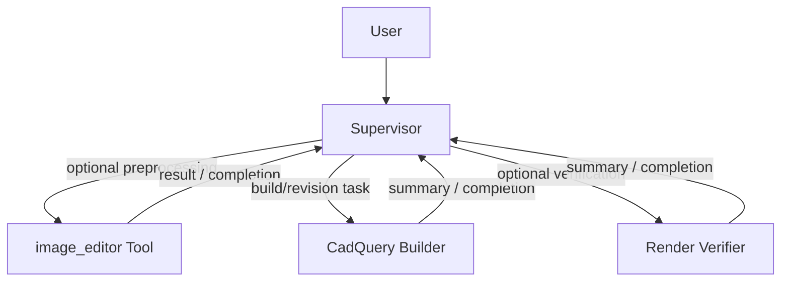

# agent3dify

A tool for converting 2D drawings into 3D models using a combination of AI agents.



```bash
uv sync
```

Run the agent with the default models:

```bash
uv run agent3dify --drawing data/b9-1.png
```

Run the agent with custom models:

```bash
uv run agent3dify \
  --drawing data/b9-1.png \
  --model openai:gpt-5 \
  --image-editor-model gemini-3-pro-image-preview \
  --view-detector-model gemini-3-flash-preview \
  --builder-model google_genai:gemini-3.1-pro-preview \
  --verifier-model google_genai:gemini-3.1-flash-preview
```

`cadquery-builder` is the primary subagent. `image_editor` is an optional preprocessing tool: `extract_outline` and `custom` use image editing, while `extract_view` uses Gemini image understanding to detect a target view and crop it deterministically. `render-verifier` is an optional review subagent.

The builder now aims to get a working `artifacts/model.step` first. STL, projection images, and `build_report.json` are optional and are expected only when they help verification or debugging.
