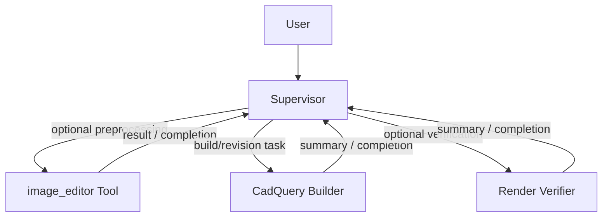
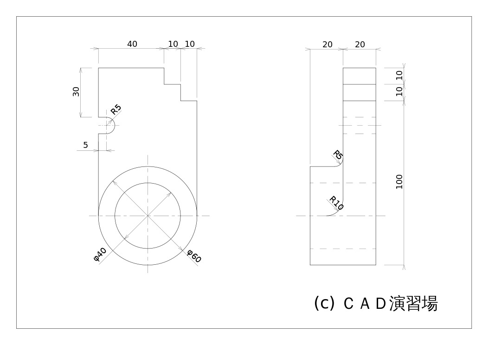
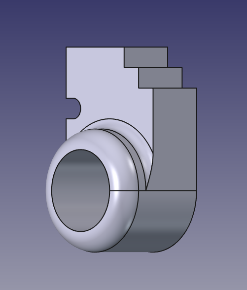

# agent3dify

A tool for converting 2D drawings into 3D models using a combination of AI agents.

This project is a development of [cad3dify](https://github.com/neka-nat/cad3dify) to an agent-based system. The root agent uses the following tools and subagents to operate:

- image_editor Tool
- CadQuery Builder
- Render Verifier

The image_editor Tool is an optional preprocessing tool: `extract_outline` and `custom` use image editing, while `extract_view` uses Gemini image understanding to detect a target view and crop it deterministically. The Render Verifier is an optional review subagent.

The CadQuery Builder is the primary subagent. It is responsible for building the 3D model from the drawing image with optional preprocessing views and verifier guidance.



## Installation

```bash
uv sync
```

## Usage

Run the agent with the default models:

```bash
uv run agent3dify --drawing data/b9-1.png
```

Run the agent with custom models:

```bash
uv run agent3dify \
  --drawing data/b9-1.png \
  --model openai:gpt-5 \
  --image-editor-model gemini-3-pro-image-preview \
  --view-detector-model gemini-3-flash-preview \
  --builder-model google_genai:gemini-3.1-pro-preview \
  --verifier-model google_genai:gemini-3.1-flash-preview
```

## Demo

### Input



### Output


